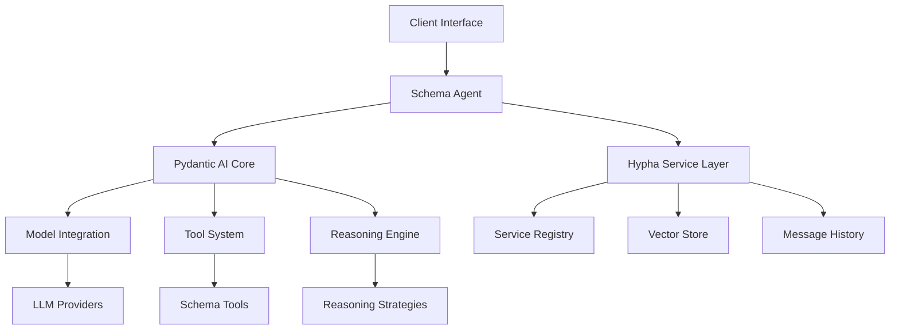

# Schema Agents Platform

[](https://pypi.org/project/schema-agents/)


**A Next-Generation Distributed Multi-Agent Framework for Collaborative Intelligent Systems**


---

## Overview

Modern applications powered by AI increasingly demand **distributed computational resources**, **dynamic service discovery**, and **collaborative human–AI workflows**. The **Schema Agents Platform** is designed from the ground up to be a scalable, intelligent backbone for these next-generation systems. By leveraging Hypha's distributed RPC framework together with cutting-edge AI orchestration via [Pydantic AI](https://github.com/pydantic/pydantic-ai), this platform empowers developers to build and deploy autonomous, intercommunicating services across domains—from federated healthcare and scientific research to data analytics, automation, and beyond.

---

## Why Schema Agents?

Monolithic agent frameworks struggle with resource fragmentation, limited tool discovery, and rigid integration. **Schema Agents** overcomes these challenges by providing:

1. **Distributed Collaboration:** Seamlessly register and run services as Hypha agents across geographic boundaries and organizational silos.
2. **Hybrid AI Empowerment:** Utilize large language models (LLMs) powered by Pydantic AI that integrate core tools, short-term memory, and long-term knowledge bases.
3. **Service Categorization:** Organize and access services by type—agents, docs, datasets, models, and tools—to simplify complex workflows.
4. **Dynamic Tooling & Discovery:** Agents come equipped with dedicated tools yet can dynamically extend their capabilities by discovering additional Hypha-registered resources using vector-based service search.
5. **Human-in-the-Loop Workflows:** Integrate intuitive web interfaces (e.g., chat UIs and in-browser code interpreters) that allow seamless blending of automation with human expertise.

---

## Key Features

### 🌐 Distributed Service Fabric
- **Universal Service Registration:** Turn any function, tool, or computational resource into a Hypha service.
- **Vector-Powered Discovery:** Automatically discover and invoke relevant services through advanced vector search and similarity matching.
- **Secure RPC Communication:** Ensure robust, encrypted communication across a distributed network of services.
- **Ray-Powered Computation:** Optionally integrate with Ray clusters for distributed computing tasks such as code execution, model training, and deployment.

### 🤖 Intelligent Agent Ecosystem
- **Pydantic AI Foundation:** Built on top of Pydantic AI's robust agent framework with extended capabilities for distributed computing and service management.
- **Rich Agent Configuration:** Configure agents with name, role, goal, backstory, and reasoning strategies for sophisticated behavior.
- **Advanced Reasoning Strategies:** Support for ReAct (Reasoning+Acting) strategy with streaming output and configurable parameters.
- **Concurrent Safety:** Built-in protection against race conditions during parallel agent execution through agent forking.
- **Message History:** Integrated message tracking for maintaining conversation context and tool interactions.
- **Streaming Support:** Native support for streaming responses during agent execution and reasoning.

### 🧠 Reasoning Capabilities
- **ReAct Strategy:** Implement the ReAct (Reasoning+Acting) pattern for systematic problem-solving.
- **Configurable Parameters:** Fine-tune ReAct behavior with parameters like max loops, confidence thresholds, and temperature.
- **Streaming Execution:** Stream intermediate thoughts, actions, and observations during reasoning.
- **Future Strategies (TODO):**
  - Chain of Thought (CoT): Step-by-step reasoning
  - Tree of Thoughts (ToT): Branching decision paths
  - Self-Reflection (SR): Iterative improvement through reflection

### 🛠️ Tool Integration
- **Runtime Tool Attachment:** Dynamically add tools during agent execution.
- **Schema-Based Tools:** Define tools using Pydantic schemas for type safety and validation.
- **Tool Discovery:** Automatic tool metadata extraction for service registration.
- **Concurrent Tool Execution:** Execute multiple tools in parallel when possible.

### 🧠 Knowledge & Resource Integration
- **Unified Knowledge Base:** Combine datasets, documents, and AI models into a single, searchable repository.
- **Artifact & Vector Search:** Manage and retrieve resources via an integrated artifact manager and high-dimensional vector search powered by Hypha.
- **Service Categorization:** Classify services into agents, docs, datasets, models, and tools for organized access and streamlined orchestration.

### 🛠️ Developer Experience
- **Python-First API:** Enjoy a type-safe, Pydantic-validated API that supports rapid development and automated documentation.
- **Rich Web Playgrounds:** Experiment with agent interactions using built-in code interpreters and chat interfaces.
- **Distributed Integration:** Easily register, search, and invoke Hypha services using familiar patterns such as `get_service` and `register_agent_service`.

---

## Architecture Overview

Schema Agents is built on a modular architecture that combines Pydantic AI's agent framework with Hypha's distributed service capabilities:



### Core Components

1. **Agent Core**
   - Built on Pydantic AI's agent system
   - Manages model interaction and tool execution
   - Handles message history and state management
   - Supports concurrent execution through agent forking

2. **Reasoning Engine**
   - Implements ReAct (Reasoning+Acting) strategy
   - Manages thought process and action execution
   - Supports streaming of intermediate steps
   - Configurable parameters for fine-tuning
   - Future strategies planned:
     - Chain of Thought (CoT)
     - Tree of Thoughts (ToT)
     - Self-Reflection (SR)

3. **Tool System**
   - Schema-based tool definition using Pydantic
   - Runtime tool attachment capability
   - Concurrent tool execution support
   - Automatic tool metadata extraction

4. **Service Layer**
   - Hypha service registration and discovery
   - Distributed service communication
   - Vector-based service search
   - Message history persistence

### Key Abstractions

1. **Agent**
   ```python
   class Agent(PydanticAgent[AgentDepsT, ResultDataT]):
       """Schema Agents Platform Agent implementation."""
       def __init__(
           self,
           model: Model | KnownModelName | None = None,
           name: str | None = None,
           role: str | None = None,
           goal: str | None = None,
           backstory: str | None = None,
           reasoning_strategy: ReasoningStrategy | None = None,
           ...
       )
   ```

2. **Reasoning Strategy**
   ```python
   class ReasoningStrategy(BaseModel):
       """Container for reasoning strategy configuration."""
       type: Literal["react"]  # Currently only supports "react"
       react_config: Optional[ReActConfig] = None
       temperature: float = 0.7
       max_tokens: Optional[int] = 2000
   ```

   **ReAct Configuration**
   ```python
   class ReActConfig(BaseModel):
       """Configuration for ReAct reasoning."""
       max_loops: int = 5  # Maximum reasoning cycles
       min_confidence: float = 0.8  # Minimum confidence threshold
   ```

   **Future Strategy Types (TODO)**
   ```python
   # Chain of Thought (CoT)
   class CoTConfig(BaseModel):
       max_steps: int
       step_prefix: str

   # Tree of Thoughts (ToT)
   class ToTConfig(BaseModel):
       max_branches: int
       max_depth: int
       min_branch_score: float

   # Self-Reflection (SR)
   class SRConfig(BaseModel):
       reflection_rounds: int
       reflection_criteria: List[str]
   ```

3. **Schema Tool**
   ```python
   @agent.schema_tool
   async def tool_function(
       param: Type = Field(..., description="Parameter description")
   ) -> ReturnType:
       """Tool documentation"""
       # Implementation
   ```

### Data Flow

1. **Request Processing**
   - Client sends request to agent
   - Agent initializes reasoning strategy if configured
   - Tools are prepared and validated

2. **Execution**
   - Model generates thoughts/actions based on strategy
   - Tools are executed concurrently when possible
   - Results are streamed if streaming is enabled

3. **Response Handling**
   - Results are validated against expected types
   - Message history is updated
   - Response is returned to client

4. **Service Integration**
   - Agent can be registered as a Hypha service
   - Service metadata includes tools and configuration
   - Other services can discover and use the agent

### Security & Concurrency

1. **Concurrency Safety**
   - Agent forking for parallel execution
   - Deep copying of mutable state
   - Thread-safe message history

2. **Security Features**
   - Model API key management
   - Service visibility control
   - Tool execution validation

---

## Core Components

### 1. Service Types

| Category    | Description                                                  | Example Use Cases              |
|-------------|--------------------------------------------------------------|--------------------------------|
| **Agents**  | Autonomous, AI-powered service agents                        | Data analysis, model training  |
| **Tools**   | Dedicated computational utilities built as services          | File conversion, math operations|
| **Models**  | AI/ML models for specialized tasks                           | LLMs, computer vision          |
| **Data**    | Datasets and knowledge resources                              | Research data, document repositories |
| **Docs**    | Documentation and protocol specifications                     | API docs, technical standards  |


## Getting Started

### Installation

Install Schema Agents and its dependencies:

```bash
pip install schema-agents pydantic-ai hypha-rpc
```

### Basic Usage

Here's a simple example of creating and using an agent:

```python
from schema_agents import Agent, schema_tool
from pydantic import Field

# Create a basic agent
agent = Agent(
    model="openai:gpt-4o-mini",
    name="Helper",
    role="General Assistant",
    goal="Help users with their tasks",
    backstory="You are a helpful AI assistant."
)

# Define a tool using schema_tool decorator
@agent.schema_tool
async def calculate(
    x: float = Field(..., description="First number"),
    y: float = Field(..., description="Second number"),
    operation: str = Field(default="add", description="Operation to perform")
) -> float:
    """Perform basic arithmetic operations"""
    if operation == "add":
        return x + y
    elif operation == "multiply":
        return x * y
    raise ValueError(f"Unknown operation: {operation}")

# Run the agent
result = await agent.run("Calculate 5 + 3")
print(result.data)  # Outputs: 8

# Run with streaming
async with agent.run_stream("What is 5 * 3?") as stream:
    async for chunk in stream:
        print(chunk)  # Outputs intermediate steps and final result
```

### Registering as a Hypha Service

Turn your agent into a distributed service:

```python
from hypha_rpc import connect_to_server

# Connect to Hypha server
server = await connect_to_server({"server_url": "http://localhost:9527"})

# Register the agent
service = await agent.register(server, service_id="math-helper")

# Use the service from another client
client = await connect_to_server({"server_url": "http://localhost:9527"})
math_service = await client.get_service("math-helper")
result = await math_service.run("Calculate 10 * 5")
```

### Using Reasoning Strategies

Configure ReAct reasoning capabilities:

```python
from schema_agents import ReasoningStrategy, ReActConfig

# Create an agent with ReAct reasoning
agent = Agent(
    model="openai:gpt-4o-mini",
    name="Analyst",
    role="Data Analyst",
    goal="Analyze data and provide insights",
    reasoning_strategy=ReasoningStrategy(
        type="react",
        react_config=ReActConfig(
            max_loops=5,
            min_confidence=0.8
        ),
        temperature=0.7
    )
)

# The agent will use ReAct reasoning for complex tasks
result = await agent.run("Analyze this dataset and explain your thought process")
```

**Future Reasoning Strategies (TODO)**

The following strategies are planned for future implementation:

1. **Chain of Thought (CoT)**
   - Step-by-step reasoning process
   - Explicit intermediate steps
   - Better transparency in decision-making

2. **Tree of Thoughts (ToT)**
   - Branching decision paths
   - Parallel exploration of options
   - Backtracking capability

3. **Self-Reflection (SR)**
   - Iterative improvement through reflection
   - Quality assessment of responses
   - Learning from past interactions

### Runtime Tool Attachment

Add tools dynamically during execution:

```python
async def fetch_data(url: str) -> dict:
    """Fetch data from a URL"""
    # Implementation
    return {"data": "example"}

async def process_data(data: dict) -> str:
    """Process the fetched data"""
    # Implementation
    return "processed result"

# Run agent with runtime tools
result = await agent.run(
    "Fetch and process data from example.com",
    tools=[fetch_data, process_data]
)
```

### Streaming Support

Handle streaming responses:

```python
async with agent.run_stream(
    "Explain quantum computing step by step",
    result_type=str
) as stream:
    async for chunk in stream._stream_response:
        if isinstance(chunk, ModelResponse):
            for part in chunk.parts:
                if isinstance(part, TextPart):
                    print(part.content)
```

---

## Core Concepts

### 1. Service Types

| Category    | Description                                                  | Example Use Cases              |
|-------------|--------------------------------------------------------------|--------------------------------|
| **Agents**  | Autonomous, AI-powered service agents                        | Data analysis, model training  |
| **Tools**   | Dedicated computational utilities built as services          | File conversion, math operations|
| **Models**  | AI/ML models for specialized tasks                           | LLMs, computer vision          |
| **Data**    | Datasets and knowledge resources                              | Research data, document repositories |
| **Docs**    | Documentation and protocol specifications                     | API docs, technical standards  |

### 2. Agent Core

Agents in Schema Agents harness dependency injection (via dataclasses) to manage state and services. An agent's core components include:
- **Tool Services:** Core functions and APIs available to the agent.
- **Memory Systems:** Integration of short-term memory for immediate task execution and long-term memory (via vector search) for knowledge retrieval.
- **Compute Resources:** Support for distributed computation (e.g., via Ray) for intensive tasks.
- **Dynamic Service Search:** Capability to discover and incorporate additional runtime tools from the Hypha ecosystem.

*Example Implementation:*

```python
from dataclasses import dataclass
from typing import Dict, List, Optional
from pydantic import BaseModel, Field
from schema_agents import Agent, RunContext, tool
from schema_agents.compute import RayCompute

# Define request models
class ExperimentParams(BaseModel):
    temperature: float = Field(..., description="Temperature in Celsius")
    duration: str = Field(..., description="Duration of experiment")
    notes: Optional[str] = Field(None, description="Optional experiment notes")

# Define dependencies
@dataclass
class LabDeps:
    """Dependencies for laboratory management"""
    compute: RayCompute
    equipment_status: Dict[str, str]
    history: List[str]
    
    def __init__(self, compute_address: str):
        self.compute = RayCompute(cluster_address=compute_address)
        self.equipment_status = {}
        self.history = []
    
    async def log_event(self, event: str):
        """Log an event to history"""
        self.history.append(event)
    
    async def update_equipment(self, equipment_id: str, status: str):
        """Update equipment status"""
        self.equipment_status[equipment_id] = status
        await self.log_event(f"Equipment {equipment_id} status: {status}")

# Create an example tool that uses dependencies
@tool
async def start_experiment(
    ctx: RunContext[LabDeps],
    params: ExperimentParams
) -> dict:
    """Start a laboratory experiment with the given parameters"""
    # Update equipment status
    await ctx.deps.update_equipment("incubator-1", "running")
    
    # Submit compute job through Ray
    job_id = await ctx.deps.compute.submit_job(
        "experiment_workflow",
        parameters=params.dict()
    )
    
    return {
        "status": "running",
        "job_id": job_id,
        "equipment": ctx.deps.equipment_status
    }

# Create the agent with rich context and personality
lab_agent = Agent(
    name="Lab Controller",
    role="Senior Laboratory Manager",
    goal="Ensure efficient and safe operation of laboratory equipment while maximizing research output",
    backstory="""
    You are a highly experienced laboratory manager with 15 years overseeing automated systems and high-throughput experiments. Your expertise in calibration and experimental design has driven breakthrough discoveries.
    """,
    deps_type=LabDeps,
    tools=[start_experiment]
)

# Example usage
async def run_lab_experiment():
    # Initialize dependencies (using a Ray cluster address)
    deps = LabDeps(compute_address="ray://...")
    
    # Run the agent task
    result = await lab_agent.run(
        "Start an experiment at 37 degrees Celsius for 24 hours",
        deps=deps
    )
    print(f"Experiment started: {result}")
    print(f"History: {deps.history}")

# Registering as a Hypha service
async def register_lab_agent(server):
    """Register the lab agent as a distributed Hypha service"""
    await server.register_service({
        "id": "lab-agent",
        "name": "Laboratory Control Agent",
        "description": "AI-powered agent for managing laboratory operations",
        "config": {
            "visibility": "public",
            "require_context": True
        },
        "agent": lab_agent,
        "run": lab_agent.run
    })
```
### 3. Structured Agent Outputs and Runtime Tools

Schema Agents supports structured outputs via Pydantic models and dynamic tool attachment at runtime. Here are examples of both features:

#### Structured Agent Outputs

You can define the expected output structure using Pydantic models:

```python
from pydantic import BaseModel, Field
from schema_agents import Agent
from typing import List, Optional

class AnalysisResult(BaseModel):
    """Structured output for analysis results"""
    user_id: int = Field(..., description="ID of the user requesting analysis")
    message: str = Field(..., description="Analysis summary message")
    confidence: float = Field(..., description="Confidence score of the analysis")
    tags: List[str] = Field(default_factory=list, description="Analysis tags")
    metadata: Optional[dict] = Field(None, description="Additional metadata")

# Create an agent with structured output
analysis_agent = Agent(
    model="openai:gpt-4o",
    name="Analysis Expert",
    instructions="You are an expert data analyst. Provide structured analysis results.",
    result_type=AnalysisResult  # Specify the expected output structure
)

# The agent will now format its responses according to the AnalysisResult schema
result = await analysis_agent.run(
    "Analyze the performance metrics for user 123",
    structured=True  # Ensure structured output
)
print(f"Analysis confidence: {result.confidence}")
print(f"Summary: {result.message}")
```

#### Runtime Tool Attachment

You can provide additional tools when calling `run()`, allowing for dynamic capability extension:

```python
from pydantic import BaseModel, Field
from schema_agents import Agent
from typing import List

# Define input/output schemas
class StockData(BaseModel):
    """Schema for stock market data"""
    symbol: str = Field(..., description="Stock symbol (e.g. AAPL)")
    price: float = Field(..., description="Current stock price")
    volume: int = Field(..., description="Trading volume")

class Analysis(BaseModel):
    """Schema for analysis results"""
    recommendation: str = Field(..., description="Buy/Sell/Hold recommendation")
    confidence: float = Field(..., description="Confidence score (0-1)")
    reasons: List[str] = Field(..., description="Reasons for the recommendation")

# Define runtime tools
async def get_stock_price(symbol: str) -> StockData:
    """Get current stock market data"""
    # Simulate market data fetch
    return StockData(
        symbol=symbol,
        price=150.0,
        volume=1000000
    )

async def calculate_trend(prices: List[float]) -> str:
    """Calculate market trend from price history"""
    # Simulate trend analysis
    return "bullish" if prices[-1] > prices[0] else "bearish"

# Create base agent
market_agent = Agent(
    model="openai:gpt-4o",
    name="Financial Analyst",
    role="Expert Financial Advisor",
    goal="Provide accurate and actionable financial analysis and recommendations",
    backstory="""
    You are a seasoned financial analyst with 20 years of experience in market analysis
    and investment strategy. Your track record includes successful predictions of major
    market trends and helping clients make informed investment decisions.
    """,
    tools=[get_stock_price, calculate_trend]
)

# Use agent with runtime tools and structured output
result = await market_agent.run(
    "Analyze AAPL stock and give me a recommendation",
    tools=[get_stock_price, calculate_trend],  # Attach tools at runtime
    result_type=Analysis  # Specify output structure
)

print(f"Recommendation: {result.recommendation}")
print(f"Confidence: {result.confidence}")
print("Reasons:")
for reason in result.reasons:
    print(f"- {reason}")
```

This approach provides:
1. **Type Safety:** Input/output schemas ensure data consistency
2. **Dynamic Tools:** Attach relevant tools based on the task
3. **Structured Results:** Get validated, well-formatted responses
4. **Flexibility:** Combine different tools and schemas as needed

### 4. Advanced Reasoning Strategies

Schema Agents supports multiple advanced reasoning strategies through a flexible, composable configuration system:

```python
from pydantic import BaseModel, Field
from typing import Union, List, Optional, Literal
from schema_agents import Agent

# Define strategy-specific configurations
class ReActConfig(BaseModel):
    """Configuration for ReAct reasoning"""
    max_loops: int = Field(5, description="Maximum reasoning cycles")
    min_confidence: float = Field(0.8, description="Minimum confidence threshold")
    timeout: int = Field(60, description="Maximum time in seconds")

class CoTConfig(BaseModel):
    """Configuration for Chain of Thought reasoning"""
    max_steps: int = Field(10, description="Maximum reasoning steps")
    step_prefix: str = Field("Step", description="Prefix for each step")

class ToTConfig(BaseModel):
    """Configuration for Tree of Thoughts reasoning"""
    max_branches: int = Field(3, description="Maximum parallel branches")
    max_depth: int = Field(3, description="Maximum depth per branch")
    min_branch_score: float = Field(0.4, description="Minimum score to explore")

class SRConfig(BaseModel):
    """Configuration for Self-Reflection reasoning"""
    reflection_rounds: int = Field(2, description="Number of improvement iterations")
    reflection_criteria: List[str] = Field(
        default_factory=lambda: ["clarity", "accuracy", "completeness"],
        description="Aspects to reflect on"
    )

# Define the strategy container
class ReasoningStrategy(BaseModel):
    """Container for reasoning strategy configuration"""
    type: Union[Literal["react"], List[Literal["react"]]]
    react_config: Optional[ReActConfig] = None
    temperature: float = Field(0.7, description="Response creativity")
    max_tokens: Optional[int] = Field(2000, description="Maximum response length")

# Example usage with single strategy
research_agent = Agent(
    model="openai:gpt-4o",
    name="Research Assistant",
    role="Scientific Research Analyst",
    goal="Help analyze and synthesize scientific literature and research data",
    backstory="""
    You are a research assistant with extensive experience in analyzing scientific papers
    and research data. Your expertise spans multiple scientific domains and you excel at
    identifying key insights and patterns in complex research.
    """,
    tools=[search_papers, analyze_data]
)

# Configure ReAct strategy
react_strategy = ReasoningStrategy(
    type="react",
    react_config=ReActConfig(
        max_loops=5,
        min_confidence=0.8
    )
)

result = await research_agent.run(
    "Find recent papers about climate change and analyze their sentiment",
    reasoning=react_strategy
)

# Example with multiple strategies
combined_strategy = ReasoningStrategy(
    type=["tot", "sr"],  # Apply Tree of Thoughts followed by Self-Reflection
    tot_config=ToTConfig(
        max_branches=3,
        max_depth=3
    ),
    sr_config=SRConfig(
        reflection_rounds=2,
        reflection_criteria=["impact", "feasibility"]
    )
)

result = await strategy_agent.run(
    "Develop a marketing strategy and refine the presentation",
    reasoning=combined_strategy
)

# Example with custom strategy composition
class CustomStrategy(ReasoningStrategy):
    """Custom strategy combining multiple approaches"""
    def __init__(self, **data):
        super().__init__(**data)
        self.type = ["react", "sr"]  # Always use ReAct + Self-Reflection
        self.react_config = ReActConfig(max_loops=3)
        self.sr_config = SRConfig(reflection_rounds=1)

# Use custom strategy
custom_strategy = CustomStrategy(
    temperature=0.8,  # Override default temperature
    max_tokens=3000   # Override default max tokens
)

result = await agent.run(
    "Analyze this complex problem",
    reasoning=custom_strategy
)
```

The strategy system provides several benefits:
1. **Type Safety:** All configurations are validated through Pydantic
2. **Configurable Parameters:** Fine-tune ReAct behavior with parameters like max loops and confidence thresholds
3. **Extensibility:** Easy to add new strategies in future updates
4. **Streaming Support:** Stream intermediate thoughts and actions during reasoning

ReAct Configuration Parameters:
- `max_loops`: Maximum reasoning cycles
- `min_confidence`: Minimum confidence threshold
- `temperature`: Response creativity (0-1)
- `max_tokens`: Maximum response length


## Supported Language Models

Schema Agents is model-agnostic, supporting multiple LLM providers through seamless integration with Pydantic AI. Built-in support includes:

### Built-in Model Support
- **OpenAI:** GPT-4, GPT-3.5 models
- **Anthropic:** Claude models
- **Google:** Gemini models
- **Ollama:** Self-hosted or local deployments
- **Groq:** Cloud-based high-performance models
- **Mistral:** Hosted models for production use
- **Custom OpenAI-compatible:** Integrate any model implementing the OpenAI API format

### Using Custom Models

For example, with a custom OpenAI-compatible model:

```python
from pydantic_ai.models.openai import OpenAIModel
from schema_agents import Agent

# Initialize a custom OpenAI-compatible model
model = OpenAIModel(
    'qwen2.5-coder',  # Model name or identifier
    base_url='https://your-custom-endpoint/v1',  # Custom API endpoint
    api_key='your-api-key'
)

# Create an agent with the custom model
agent = Agent(
    model=model,
    name="Code Assistant",
    instructions="You are a helpful coding assistant.",
)

# Use the agent
result = await agent.run("Write a hello world program in Python")
print(result.data)
```

### Example with Ollama Self-hosted Model

```python
from pydantic_ai.models.openai import OpenAIModel
from schema_agents import Agent

# Initialize an Ollama model
model = OpenAIModel(
    'qwen2.5-coder',
    base_url='http://localhost:11434/v1',
    api_key='ollama'
)

# Create the agent
agent = Agent(
    model=model,
    name="General Assistant",
    instructions="You are a helpful assistant.",
)

# Use the agent
result = await agent.run("What is the capital of France?")
print(result.data)
```

### Model Configuration

Each model provider might require specific environment variables:

```python
import os
os.environ["OPENAI_API_KEY"] = "your-api-key"
os.environ["GEMINI_API_KEY"] = "your-api-key"
os.environ["ANTHROPIC_API_KEY"] = "your-api-key"
```

For detailed configuration and additional model providers, refer to the [Pydantic AI Models documentation](https://ai.pydantic.dev/models/).


---

## Roadmap

| Milestone   | Features & Improvements                                                      | Target Date  |
|-------------|------------------------------------------------------------------------------|--------------|
| **Q3 2024** | Agent Teams; Enhanced Service Registry; Improved Vector-Powered Service Search | Q3 2024      |
| **Q4 2024** | Integrated Federated Learning; Web UI Builder; Automated Documentation        | Q4 2024      |
| **Q1 2025** | Domain-Specific Extensions (e.g., Physics, BioLab, Quantum); Advanced Workflow Orchestration | Q1 2025      |

---

## Contributing

We welcome contributions from developers, researchers, and enthusiasts to help evolve Schema Agents. Your insights on distributed collaboration and advanced AI integration are invaluable!

- **Bug Reports & Feature Requests:** Please use the GitHub issues page.
- **Pull Requests:** Follow our [Contribution Guidelines](CONTRIBUTING.md) for coding standards and submission instructions.
- **Community:** Join our [Developer Community](https://community.hypha.ai) for discussions, updates, and support.

---

## License

Schema Agents Platform is released under the [MIT License](LICENSE).

---

## Final Words

Schema Agents Platform is more than an AI framework—it's a comprehensive, distributed ecosystem that enables seamless collaboration between agents, documents, datasets, models, and tools. By harnessing Hypha's robust service registration and Pydantic AI's powerful LLM capabilities, you can build revolutionary applications for data management, AI model serving, federated learning, automation, and instrument control.

Join us, star the repository, and help shape the future of collaborative intelligent systems!

---

**Schema Agents Platform** is proudly built by the [Hypha Team](https://hypha.ai) with ❤️. Enjoy, contribute, and make it your own!
